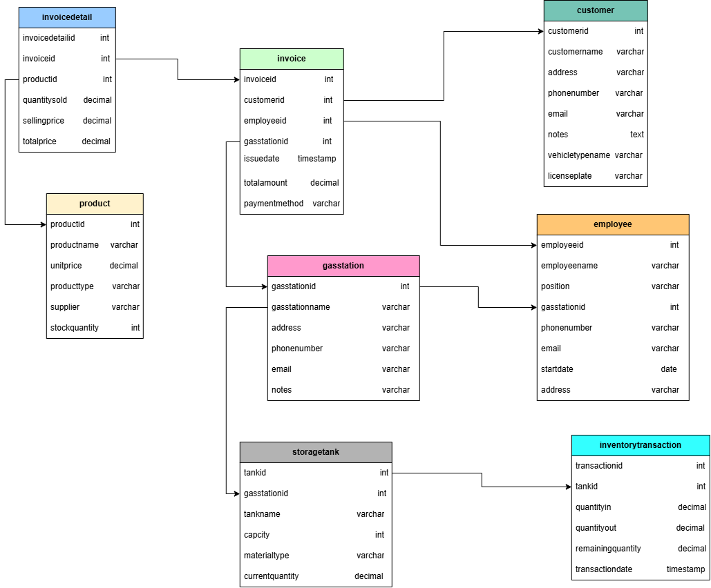

# GasStationDB - Data Warehouse & Business Intelligence Project

> **Repository:** Gasstation_KRK  
> **Group:** Project Group 1  
> **Course:** SC663402 Data Warehouse and Big Data Analytics  

โครงงานออกแบบและพัฒนาคลังข้อมูล (Data Warehouse) จากระบบ OLTP สู่ OLAP สำหรับธุรกิจสถานีบริการน้ำมัน (GasStationDB) เพื่อตอบคำถามทางธุรกิจและสร้าง Interactive Dashboard สื่อสารข้อมูลเพื่อการบริหารจัดการ

---
## Tech Stack Badges

---

## สมาชิกในกลุ่ม

| รหัสนักศึกษา | ชื่อ-นามสกุล | บทบาทหน้าที่ |
| :---: | :--- | :--- |
| **673020045-9** | นายประภากร มีใส | Project Lead & Data Architect[cite: 1, 3] |
| **673020244-3** | นายกิตติพัศ ลาล้ำ | Data Engineer[cite: 1, 3] |
| **673020256-6** | นางสาวปภาวดี เหมาะดี | Data Analyst Lead[cite: 1, 3] |
| **673020264-7** | นางสาวสุกัญญา อุดมกัน | Data Modeler[cite: 1, 3] |
| **673020266-3** | นางสาวสุพิชญา ผ่องสนาม | Data Quality Engineer[cite: 1, 3] |
| **673020270-2** | นางสาวอาทิติญา ชาชัย | Business Intelligence Analyst[cite: 1, 3] |

---

## 1. Operational Database (OLTP)

* **ชุดข้อมูลต้นทาง:** GasStationDB (HCM City - PostgreSQL) จาก Kaggle[cite: 2]
* **ขอบเขตระบบ:** บันทึกธุรกรรมการขายน้ำมันประจำวัน การจัดการคลังน้ำมัน หัวจ่าย พนักงาน และลูกค้า รวม 24 วัน (15 มีนาคม – 7 เมษายน 2024)[cite: 2]
* **ER Diagram ต้นทาง:** [คลิกเปิดดู ER Diagram บน Google Drive](https://drive.google.com/file/d/1JGIX7BkISNF0DNA6mARoEywLSQCLhmJH/view)

แบบจำลองฐานข้อมูลเชิงสัมพันธ์นี้ ออกแบบเพื่อรองรับการดำเนินงานบริหารจัดการสถานีบริการน้ำมัน ครอบคลุมกระบวนการขาย บุคลากรประจำสาขา และปริมาณน้ำมันคงคลัง[cite: 2] แบ่งเป็น 3 กลุ่มหลัก:

1. **กลุ่มข้อมูลหลักและโครงสร้างสาขา (Master Data & Infrastructure):** `gasstation`, `employee`, `customer`, `product`[cite: 2]
2. **กลุ่มธุรกรรมงานขาย (Sales Transactions):** `invoice`, `invoicedetail`[cite: 2]
3. **กลุ่มคลังและการเคลื่อนไหวน้ำมันเชื้อเพลิง (Inventory Transactions):** `storagetank`, `inventorytransaction`[cite: 2]
