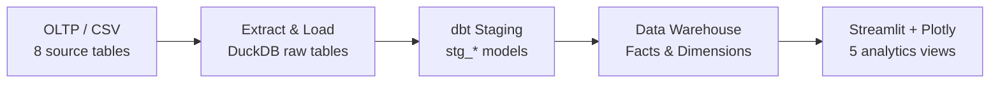

<h1 align="center">GasStationDB</h1>

<p align="center">
  <strong>Data Warehouse & Business Intelligence Project</strong><br>
  จากฐานข้อมูลธุรกรรม (OLTP) สู่คลังข้อมูลเพื่อการวิเคราะห์ (OLAP) และ Interactive Dashboard
</p>

<p align="center">
  <a href="https://github.com/Papawadee-Mohdee/Gasstation_KRK/tree/krk_gas"></a>
  <a href="https://www.python.org/"></a>
  <a href="https://duckdb.org/"></a>
  <a href="https://www.getdbt.com/"></a>
  <a href="https://streamlit.io/"></a>
  <a href="LICENSE"></a>
</p>

<p align="center">
  <a href="https://kdvxcyh5deojv4aewtnmwb.streamlit.app/"><strong>Live Demo</strong></a>
  &nbsp;·&nbsp;
  <a href="https://drive.google.com/file/d/1JGIX7BkISNF0DNA6mARoEywLSQCLhmJH/view"><strong>OLTP ER Diagram</strong></a>
  &nbsp;·&nbsp;
  <a href="https://drive.google.com/file/d/1p_veBgEP3hKBFL9z522rmi3cKWPJ4uxq/view?usp=sharing"><strong>Data Cube / Star Schema</strong></a>
</p>

> **Repository:** [Gasstation_KRK](https://github.com/Papawadee-Mohdee/Gasstation_KRK/tree/krk_gas)  
> **Group:** Project Group 1  
> **Course:** SC663402 — Data Warehouse and Big Data Analytics

---

## Contents

1. [Project Overview](#project-overview)
2. [Team Members](#team-members)
3. [Dataset & OLTP](#dataset--oltp)
4. [Data Architecture & ELT](#data-architecture--elt)
5. [Star Schema & Data Cube](#star-schema--data-cube)
6. [Project Structure](#project-structure)
7. [15 Business Questions](#15-business-questions)
8. [Interactive Dashboard](#interactive-dashboard)
9. [Quick Start](#quick-start)
10. [Technology Stack](#technology-stack)
11. [Data Limitations & Next Steps](#data-limitations--next-steps)
12. [License](#license)

---

## Project Overview

โครงงานนี้ออกแบบและพัฒนา **คลังข้อมูลสำหรับธุรกิจสถานีบริการน้ำมัน** โดยนำข้อมูลจากระบบปฏิบัติการ (OLTP) เข้าสู่กระบวนการ **Extract, Load, Transform (ELT)** แล้วจัดทำแบบจำลองเชิงมิติสำหรับการวิเคราะห์ (OLAP) ก่อนนำเสนอข้อมูลผ่าน **Streamlit และ Plotly** เพื่อสนับสนุนการตัดสินใจด้านยอดขาย สินค้า การชำระเงิน คลังน้ำมัน และการดำเนินงานของแต่ละสาขา

**วัตถุประสงค์หลัก**

- ออกแบบกระบวนการเปลี่ยนข้อมูลธุรกรรมให้เป็นคลังข้อมูลแบบ Fact / Dimension
- วิเคราะห์พฤติกรรมยอดขายและการดำเนินงานโดยจำแนกตามช่วงเวลา สถานี และสายถนน
- ติดตามระดับน้ำมันคงเหลือและเปรียบเทียบรายการจ่ายออกกับยอดขาย
- สื่อสารผลการวิเคราะห์ด้วย Interactive Dashboard และตัวกรองที่ผู้ใช้เลือกได้

## Team Members

| รหัสนักศึกษา | ชื่อ–นามสกุล | บทบาท |
|:---:|:---|:---|
| **673020045-9** | นายประภากร มีใส | Project Lead & Data Architect |
| **673020244-3** | นายกิตติพัศ ลาล้ำ | Data Engineer |
| **673020256-6** | นางสาวปภาวดี เหมาะดี | Data Analyst Lead |
| **673020264-7** | นางสาวสุกัญญา อุดมกัน | Data Modeler |
| **673020266-3** | นางสาวสุพิชญา ผ่องสนาม | Data Quality Engineer |
| **673020270-2** | นางสาวอาทิติญา ชาชัย | Business Intelligence Analyst |

## Dataset & OLTP

ข้อมูลตั้งต้นของโครงงานคือ **GasStationDB (HCM City – PostgreSQL)** ซึ่งกลุ่มระบุว่ามาจาก Kaggle โดยครอบคลุมข้อมูลธุรกรรมการขาย บุคลากร ลูกค้า สินค้า สถานี และการเคลื่อนไหวน้ำมัน **15 มีนาคม – 7 เมษายน 2024 (24 วัน ตามคำอธิบายชุดข้อมูลของกลุ่ม)**

| กลุ่มข้อมูล | ตาราง OLTP | ใช้สำหรับ |
|:---|:---|:---|
| Master Data | `GasStation`, `Employee`, `Customer`, `Product` | ข้อมูลสถานี พนักงาน ลูกค้า และสินค้า |
| Sales Transactions | `Invoice`, `InvoiceDetail` | หัวบิล รายการสินค้า ยอดขาย และวิธีชำระเงิน |
| Inventory Transactions | `StorageTank`, `InventoryTransaction` | ความจุถัง ปริมาณรับเข้า จ่ายออก และคงเหลือ |

### Operational ER Diagram

แบบจำลองฐานข้อมูลต้นทาง (OLTP) แสดงความสัมพันธ์ระหว่างข้อมูลสถานี พนักงาน ลูกค้า สินค้า ใบแจ้งหนี้ รายการขาย ถังเก็บ และธุรกรรมคลังน้ำมัน

<p align="center">
  <a href="https://drive.google.com/file/d/1JGIX7BkISNF0DNA6mARoEywLSQCLhmJH/view" target="_blank">
    
  </a>
</p>

<p align="center"><em>Operational ER Diagram — คลิกที่ภาพเพื่อเปิดไฟล์ต้นฉบับบน Google Drive</em></p>
**[เปิดดู Operational ER Diagram บน Google Drive](https://drive.google.com/file/d/1JGIX7BkISNF0DNA6mARoEywLSQCLhmJH/view)**

> **หมายเหตุด้านแหล่งข้อมูล:** ก่อนส่งงานฉบับสุดท้าย ควรเพิ่มลิงก์หน้า Dataset บน Kaggle ที่ตรงกับชุดข้อมูลต้นฉบับ เพื่อให้ตรวจสอบที่มาและเงื่อนไขการใช้งานได้

## Data Architecture & ELT



| ขั้นตอน | เครื่องมือ | รายละเอียด |
|:---:|:---|:---|
| **1. Extract / Load** | Python, DuckDB | อ่าน CSV ต้นทาง 8 ตารางและโหลดเป็น Raw Tables |
| **2. Staging** | dbt Core, dbt-duckdb | เตรียมข้อมูลและจัดรูปแบบฟิลด์ก่อนนำไปสร้างโมเดลวิเคราะห์ |
| **3. Transformation** | dbt, DuckDB | สร้าง Fact และ Dimension พร้อมความสัมพันธ์ตามโมเดลคลังข้อมูล |
| **4. Data Validation** | dbt data tests | กำหนดการทดสอบ `not_null`, `unique` และ `relationships` ใน `schema.yml` |
| **5. Visualization** | Streamlit, Plotly | แสดงกราฟ KPI ตาราง และตัวกรองสำหรับผู้ใช้ |

เมื่อเปิดแอปครั้งแรก หากยังไม่มีฐานข้อมูลที่สมบูรณ์ `warehouse_setup.py` จะโหลด CSV และเรียก dbt เพื่อสร้าง `Gasstation_dw_duckdb/dev.duckdb` อัตโนมัติ โดยไม่เขียนทับฐานข้อมูลเดิมที่ไม่สมบูรณ์

## Star Schema & Data Cube

**แบบจำลองคลังข้อมูลจริงในสาขา `krk_gas`:**

| ประเภท | โมเดล | Grain / คำอธิบาย |
|:---|:---|:---|
| Fact | `fact_invoices` | หนึ่งแถวต่อใบแจ้งหนี้ (`InvoiceID`) — ยอดรวมและจำนวนบิล |
| Fact | `fact_sales` | หนึ่งแถวต่อรายการขาย (`InvoiceDetailID`) — ปริมาณและมูลค่าขาย |
| Fact | `fact_inventory` | หนึ่งแถวต่อธุรกรรมคลัง (`TransactionID`) — น้ำมันเข้า ออก และคงเหลือ |
| Dimension | `dim_date`, `dim_hour` | วิเคราะห์ตามวันและชั่วโมง |
| Dimension | `dim_gasstation` | มิติสถานีและข้อมูลพื้นที่/สายถนน |
| Dimension | `dim_customer`, `dim_employee` | ข้อมูลลูกค้าและพนักงาน |
| Dimension | `dim_products`, `dim_tanks` | ข้อมูลสินค้าและถังเก็บ |

### Data Model Diagram / Data Cube

แผนภาพนี้แสดงโครงสร้างคลังข้อมูลสำหรับการวิเคราะห์ โดยเชื่อม Fact Tables เข้ากับ Dimension Tables เพื่อรองรับการวิเคราะห์ยอดขาย สินค้า ลูกค้า พนักงาน เวลา สถานี และคลังน้ำมัน

<p align="center">
  <a href="https://drive.google.com/file/d/1p_veBgEP3hKBFL9z522rmi3cKWPJ4uxq/view?usp=sharing" target="_blank">
    
  </a>
</p>

<p align="center"><em>Data Model / Data Cube Diagram — คลิกที่ภาพเพื่อเปิดไฟล์ต้นฉบับบน Google Drive</em></p>
**[เปิดดู Data Model / Data Cube Diagram บน Google Drive](https://drive.google.com/file/d/1p_veBgEP3hKBFL9z522rmi3cKWPJ4uxq/view?usp=sharing)**

> **ข้อควรระวังในการสรุปข้อมูล:** ห้ามรวม `total_amount` จากหัวบิลซ้ำตามจำนวนรายการสินค้า และไม่ควรนำ `remaining_quantity` ของถังเดียวกันมาบวกข้ามเวลา ให้ใช้ยอดคงเหลือจากธุรกรรมล่าสุดตามวันที่เลือก

## Project Structure

โครงสร้างต่อไปนี้อ้างอิงไฟล์ที่มีอยู่ในสาขา `krk_gas` (ไม่รวมไฟล์ที่สร้างขึ้นเองระหว่างติดตั้ง เช่น `.venv/` และ `dev.duckdb`)

```text
Gasstation_KRK/
├── .devcontainer/
│   └── devcontainer.json                # GitHub Codespaces / Python 3.12
├── .streamlit/
│   └── config.toml                      # การตั้งค่า Streamlit
├── .vscode/
│   └── settings.json                    # การตั้งค่า VS Code
├── Gasstation_dw_duckdb/
│   ├── Datasets/                        # CSV ต้นทาง 8 ไฟล์
│   │   ├── Customer.csv
│   │   ├── Employee.csv
│   │   ├── GasStation.csv
│   │   ├── InventoryTransaction.csv
│   │   ├── Invoice.csv
│   │   ├── InvoiceDetail.csv
│   │   ├── Product.csv
│   │   └── StorageTank.csv
│   ├── models/
│   │   ├── staging/
│   │   │   ├── src_gas.yml
│   │   │   ├── stg_customer.sql
│   │   │   ├── stg_employee.sql
│   │   │   ├── stg_gasstation.sql
│   │   │   ├── stg_inventorytransaction.sql
│   │   │   ├── stg_invoice.sql
│   │   │   ├── stg_invoicedetail.sql
│   │   │   ├── stg_product.sql
│   │   │   └── stg_storagetank.sql
│   │   └── datawarehouse/
│   │       ├── schema.yml
│   │       ├── dim_customer.sql
│   │       ├── dim_date.sql
│   │       ├── dim_employee.sql
│   │       ├── dim_gasstation.sql
│   │       ├── dim_hour.sql
│   │       ├── dim_products.sql
│   │       ├── dim_tanks.sql
│   │       ├── fact_invoices.sql
│   │       ├── fact_inventory.sql
│   │       └── fact_sales.sql
│   ├── dbt_project.yml
│   └── profiles.yml
├── scripts/
│   └── setup.sh                         # ติดตั้ง/ซ่อม .venv
├── app.py                               # Streamlit Dashboard รวม 5 หมวด
├── warehouse_setup.py                   # โหลด CSV และสร้างคลังข้อมูลอัตโนมัติ
├── requirements.txt                     # Python dependencies
├── .gitignore
├── LICENSE
└── README.md
```

## 15 Business Questions

โจทย์วิเคราะห์ทางธุรกิจทั้ง 15 ข้อตามขอบเขตโครงงาน แบ่งเป็น 5 กลุ่ม โดย **โจทย์ที่ระบุด้านล่างเป็นขอบเขตการวิเคราะห์ ไม่ได้หมายความว่าทุกข้อมีกราฟสำเร็จรูปในแอปปัจจุบัน**

### 1) Sales & Revenue — ยอดขายและรายได้

| # | คำถามทางธุรกิจ |
|:---:|:---|
| **Q1** | รายได้รวมแยกตามสาขาในแต่ละเดือนเป็นเท่าใด? |
| **Q2** | สินค้า/น้ำมันชนิดใดขายดีที่สุด ทั้งด้านปริมาณ (`quantity_sold`) และมูลค่า (`sales_amount`)? |
| **Q3** | ลูกค้านิยมใช้ช่องทางชำระเงินใด และแต่ละช่องทางมีสัดส่วนเท่าใด? |
| **Q4** | มูลค่าซื้อเฉลี่ยต่อบิล (Average Transaction Value) เท่าใด และเปลี่ยนแปลงตามเวลาอย่างไร? |

### 2) Customer Analytics — ด้านลูกค้า

| # | คำถามทางธุรกิจ |
|:---:|:---|
| **Q5** | ลูกค้ารายใดซื้อบ่อยที่สุด และรายใดมีมูลค่าซื้อสะสมสูงสุด? |
| **Q6** | ประเภทยานพาหนะใดใช้บริการบ่อยที่สุด? |
| **Q7** | ลูกค้ากี่รายไม่กลับมาซื้อซ้ำในรอบ 3–6 เดือน (Customer Churn)? **ต้องเพิ่มข้อมูลย้อนหลัง** |

### 3) Employee Analytics — ด้านพนักงาน

| # | คำถามทางธุรกิจ |
|:---:|:---|
| **Q8** | พนักงานคนใดสร้างยอดขายได้สูงสุดในแต่ละเดือน? |
| **Q9** | จำนวนและตำแหน่งของพนักงานแต่ละสาขาสอดคล้องกับปริมาณธุรกรรมหรือไม่? |

### 4) Inventory Analytics — ด้านสต๊อกและถังเก็บ

| # | คำถามทางธุรกิจ |
|:---:|:---|
| **Q10** | ระดับน้ำมันคงเหลือของแต่ละถังใกล้ถึงเกณฑ์ที่ต้องสั่งเติมหรือยัง? |
| **Q11** | ปริมาณสินค้าคงเหลือเทียบกับยอดขายของแต่ละชนิดเป็นอย่างไร? |
| **Q12** | น้ำมันรับเข้า–จ่ายออกแต่ละถังสอดคล้องกับปริมาณขายหรือไม่ และรายการใดควรตรวจสอบเพิ่มเติม? |
| **Q13** | ซัพพลายเออร์รายใดจัดหาสินค้าบ่อยที่สุด และส่วนต่างระหว่างราคาขายกับต้นทุนเป็นเท่าใด? **ต้องยืนยันข้อมูลต้นทุนและการจัดส่ง** |

### 5) Station Analytics — ด้านสาขา

| # | คำถามทางธุรกิจ |
|:---:|:---|
| **Q14** | สาขาใดมีรายได้สูงสุด/ต่ำสุดเมื่อเปรียบเทียบตามช่วงเวลา? |
| **Q15** | ความจุถังเก็บของแต่ละสาขารองรับยอดขายเฉลี่ยต่อวันได้เพียงพอหรือไม่? |

## Interactive Dashboard

**Live Demo:** [GasStation Enterprise DW & Analytics Studio](https://kdvxcyh5deojv4aewtnmwb.streamlit.app/)

สาขา `krk_gas` ปัจจุบันเปิดผ่าน **`app.py` ไฟล์เดียว** และมีเมนูวิเคราะห์จริง 5 หมวด ดังนี้

| เมนูในแอป | ตัวอย่างการวิเคราะห์ |
|:---|:---|
| **ยอดขายและพื้นที่** | ยอดขายรายวัน รายได้ตามสายถนน สถานีที่มียอดขายสูง และการเปรียบเทียบระหว่างสถานี |
| **สินค้าและการชำระเงิน** | สินค้าขายดี สัดส่วนเบนซิน/ดีเซล วิธีชำระเงิน และค่าธรรมเนียมบัตรเครดิตจำลอง |
| **ช่วงเวลาและการให้บริการ** | ชั่วโมงที่มีการออกบิลสูงสุด และเปรียบเทียบวันธรรมดากับวันหยุดสุดสัปดาห์ |
| **น้ำมันคงเหลือ** | ระดับน้ำมันล่าสุดในถัง และเปรียบเทียบรายการจ่ายออกกับปริมาณขาย |
| **พนักงานและประสิทธิภาพ** | โครงสร้างตำแหน่งงาน พนักงานที่ออกบิลมาก และยอดขายต่อจำนวนพนักงาน |

ตัวกรองของแอปประกอบด้วย **ช่วงวันที่ · สายถนน · สถานี** เพื่อให้เปรียบเทียบพื้นที่และเจาะลึกรายสาขาได้ โดยกลุ่มพื้นที่ใช้ **สายถนนจากข้อมูลจริง** ไม่ใช่ Business Region ที่กำหนดขึ้นเอง

<p align="center">
  
</p>
<p align="center"><em>ภาพตัวอย่าง Web Application ที่กลุ่มจัดเตรียม</em></p>

<details>
<summary><strong>ดูภาพเพิ่มเติม: GAS STATION INSIGHT</strong></summary>

<p align="center">
  
</p>
</details>

## Quick Start

### Prerequisites

- **Python 3.12** (เวอร์ชันที่กำหนดใน Codespaces และใช้ตรวจสอบ dependencies)
- **Git** และ Terminal แบบ Linux/macOS หรือ **GitHub Codespaces**
- อินเทอร์เน็ตสำหรับติดตั้งแพ็กเกจครั้งแรก

### Option A — GitHub Codespaces

Codespace ใหม่ในสาขานี้จะเรียก `bash scripts/setup.sh` อัตโนมัติผ่าน `postCreateCommand` เพื่อสร้าง `.venv` และติดตั้ง dependencies เมื่อเริ่มใช้งานครั้งแรก

เปิด Terminal ที่โฟลเดอร์หลักของโปรเจกต์ แล้วใช้คำสั่ง:

```bash
source .venv/bin/activate
streamlit run app.py
```

หากเป็น Codespace เดิม หรือ `.venv` ใช้งานไม่ได้ ให้สั่ง `bash scripts/setup.sh` ก่อน แล้วจึงเปิดแอป

### Option B — Install locally (Linux / macOS / WSL)

```bash
# 1) Clone เฉพาะสาขาที่ใช้งาน
git clone --branch krk_gas --single-branch \
  https://github.com/Papawadee-Mohdee/Gasstation_KRK.git
cd Gasstation_KRK

# 2) สร้าง .venv และติดตั้งแพ็กเกจจาก requirements.txt
bash scripts/setup.sh

# 3) เปิด virtual environment และรันเว็บแอป
source .venv/bin/activate
streamlit run app.py
```

เมื่อแอปเริ่มทำงาน ให้เปิด URL ที่ Streamlit แสดงใน Terminal (ปกติคือ `http://localhost:8501`) หรือเปิดพอร์ต **8501** ในแท็บ **Ports** ของ Codespaces และหยุดแอปด้วย `Ctrl+C`

> **การสร้างฐานข้อมูล:** หากยังไม่มี `Gasstation_dw_duckdb/dev.duckdb` แอปจะเรียกกระบวนการโหลด CSV และรัน dbt ให้อัตโนมัติระหว่างการเริ่มทำงานครั้งแรก ไม่ต้องรัน `load.py` เพราะไม่มีไฟล์ดังกล่าวในสาขาปัจจุบัน  
> **หมายเหตุ Windows:** สำหรับ Windows แนะนำ GitHub Codespaces หรือ WSL เนื่องจากสคริปต์สร้างคลังข้อมูลใช้ `fcntl` ซึ่งรองรับระบบ Unix-like

**ทดสอบโมเดล dbt หลังสร้างฐานข้อมูลแล้ว (ทางเลือก):**

```bash
cd Gasstation_dw_duckdb
dbt test --profiles-dir .
```

**ใช้ฐานข้อมูล DuckDB ที่มีอยู่แล้ว (ทางเลือก):** ตั้งค่า `GASSTATION_DB` ให้ชี้ไปยังไฟล์ที่มี Fact/Dimension ครบ ก่อนรัน `streamlit run app.py`

## Technology Stack

| Component | Technology | Purpose |
|:---|:---|:---|
| **Language** | Python 3.12 | สคริปต์สำหรับสร้างคลังข้อมูลและ Web Application |
| **Storage / OLAP** | DuckDB 1.5.4 | เก็บและประมวลผลข้อมูลคลังในไฟล์ฐานข้อมูล |
| **ELT / Modeling** | dbt Core 1.11.12 + dbt-duckdb 1.10.1 | จัดการ Staging, Fact, Dimension และ Data Tests |
| **Data Processing** | pandas 3.0.5 | จัดรูปและสรุปข้อมูลสำหรับแดชบอร์ด |
| **Data Visualization** | Streamlit 1.60.0 + Plotly 7.1.0 | สร้างหน้าเว็บ ตัวกรอง KPI และกราฟแบบ Interactive |
| **Data Modeling** | draw.io | ออกแบบ OLTP ER Diagram และ Data Cube / Star Schema |
| **Development** | GitHub + Codespaces | จัดการเวอร์ชันและสภาพแวดล้อมสำหรับทำงานร่วมกัน |

เวอร์ชัน Python packages ข้างต้นอ้างอิงจาก `requirements.txt` ในสาขา `krk_gas`

## Data Limitations & Next Steps

- **ช่วงเวลาข้อมูลสั้น:** ข้อมูล 24 วันไม่เพียงพอสำหรับการวิเคราะห์การเลิกซื้อซ้ำในรอบ **3–6 เดือน (Q7)** และการสรุปแนวโน้มระยะยาว
- **ข้อมูลต้นทุนยังไม่ชัดเจน:** ตาราง `Product` มี `Supplier` และ `UnitPrice` แต่ไม่ควรใช้ `UnitPrice` เป็น *ต้นทุนจัดซื้อ* โดยไม่มีการยืนยันเพิ่มเติม จึงยังไม่ควรสรุป Profit Margin ตาม Q13
- **ข้อมูลพนักงานเป็น Snapshot:** จำนวนพนักงานใน Master Data ไม่ใช่จำนวนคนเข้ากะจริง และยังไม่เพียงพอสำหรับวินิจฉัยความเหมาะสมของอัตรากำลัง
- **ความคลาดเคลื่อนน้ำมัน:** ส่วนต่างระหว่างยอดจ่ายออกกับยอดขายควรใช้เป็นสัญญาณสำหรับตรวจสอบ ไม่ใช่ข้อพิสูจน์ว่าเกิดการรั่วไหลหรือสูญหาย
- **หน่วยเงิน:** ก่อนเผยแพร่ผลวิเคราะห์ ควรตรวจสอบสกุลเงินของชุดข้อมูลต้นฉบับ และทำป้ายกำกับทุกกราฟให้สอดคล้องกัน
- **ส่วนขยายที่เสนอ:** เพิ่ม **DW Table Inspector / SQL Console** และ **Ad-Hoc OLAP Explorer** หลังพัฒนาและทดสอบเสร็จ (ยังไม่ใช่เมนูที่มีใน `app.py` สาขานี้)

## License

โปรเจกต์นี้เผยแพร่โค้ดภายใต้ [MIT License](LICENSE) ตามไฟล์ `LICENSE` ใน Repository โดยสิทธิในการใช้ชุดข้อมูลและรูปภาพต้นทางให้เป็นไปตามเงื่อนไขของเจ้าของข้อมูลแต่ละแหล่ง

---

<p align="center"><strong>Project Group 1 · SC663402 · GasStationDB</strong></p>
